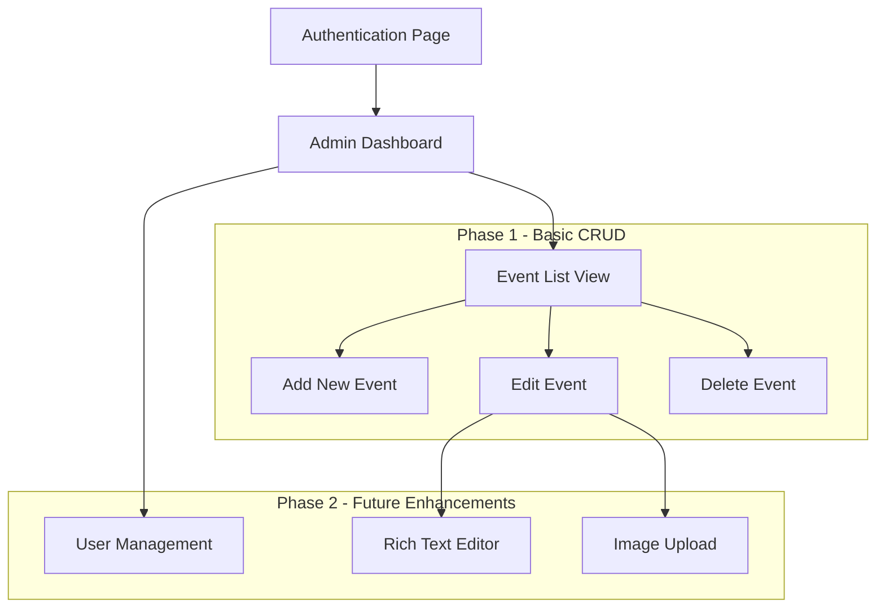
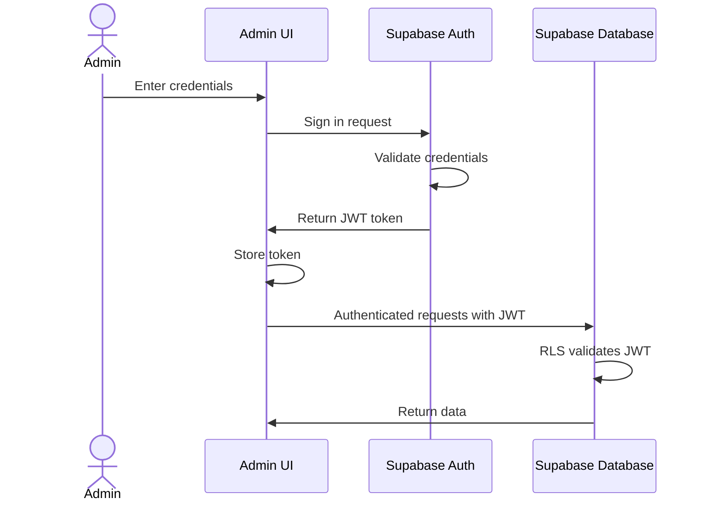

# Event Management Interface Implementation Plan

This document outlines the plan for implementing an admin interface to manage events in the Supabase database.

## 1. Architecture Overview

We'll build a secure, user-friendly admin interface with the following components:



## 2. Authentication System

We'll leverage Supabase's built-in authentication:



## 3. Database & Security Configuration

1. **Update RLS Policies**:
   - Modify existing policies to restrict write operations to authenticated users
   - Create admin role for event management

```sql
-- Enable RLS on tables
ALTER TABLE groups ENABLE ROW LEVEL SECURITY;
ALTER TABLE events ENABLE ROW LEVEL SECURITY;

-- Read access for all users
CREATE POLICY "Allow read access for all users" 
ON events FOR SELECT USING (true);

-- Write access only for authenticated users
CREATE POLICY "Allow write access for authenticated users" 
ON events FOR INSERT 
WITH CHECK (auth.role() = 'authenticated');

CREATE POLICY "Allow update access for authenticated users" 
ON events FOR UPDATE 
USING (auth.role() = 'authenticated');

CREATE POLICY "Allow delete access for authenticated users" 
ON events FOR DELETE 
USING (auth.role() = 'authenticated');
```

## 4. Implementation Components

### 4.1 Authentication Pages

1. **Login Page**:
   - Email/password form
   - Authentication state management
   - Error handling

2. **User Management** (Phase 2):
   - Admin user creation
   - Password reset functionality

### 4.2 Admin Dashboard

1. **Event List View**:
   - Tabular display of all events
   - Sorting and filtering options
   - Action buttons for edit/delete
   
2. **Event Creation Form**:
   - Form with all required fields
   - Group selection dropdown
   - Date/time picker
   - Form validation

3. **Event Edit Form**:
   - Pre-populated form with existing event data
   - Same validation as creation form
   
4. **Event Deletion**:
   - Confirmation dialog
   - Success/error feedback

## 5. Implementation Steps

### Phase 1: Core Implementation

1. **Create Authentication System**:
   - Implement login page
   - Set up authentication state management
   - Configure protected routes

2. **Build Admin Dashboard Structure**:
   - Create responsive layout
   - Implement navigation
   - Set up route protection

3. **Implement Event List View**:
   - Create table component
   - Connect to Supabase events table
   - Add sorting/filtering functionality

4. **Create Event Forms**:
   - Build reusable form components
   - Implement validation
   - Connect to Supabase for CRUD operations

5. **Set Up RLS Policies**:
   - Update database security rules
   - Test permissions

### Phase 2: Enhancements (Future)

1. **Rich Text Editor Integration**:
   - Select appropriate editor library
   - Integrate with event forms
   - Store formatted content in Supabase

2. **Image Upload System**:
   - Configure Supabase Storage
   - Create upload UI
   - Implement image preview and management

## 6. Technical Details

### 6.1 File Structure

```
/admin/
  index.html                 # Admin dashboard entry point
  auth/
    login.html               # Login page
    auth.js                  # Authentication utilities
  events/
    event-list.js            # Event listing component
    event-form.js            # Reusable form for create/edit
    event-service.js         # Supabase event operations
  components/
    layout.js                # Admin layout components
    table.js                 # Reusable table component
    form-controls.js         # Form input components
  styles/                    # CSS for admin interface
```

### 6.2 Required Libraries/Tools

1. **Core Technologies**:
   - HTML/CSS/JavaScript
   - Supabase JS Client

2. **UI Libraries** (options):
   - Vanilla JavaScript with custom components
   - Lightweight framework like Alpine.js
   - Component library like Shoelace or Bootstrap

3. **Form Handling**:
   - Form validation
   - Date/time picker

## 7. Security Considerations

1. **Authentication**:
   - JWT token management
   - Secure login process
   - Session expiration

2. **Authorization**:
   - Row-level security policies
   - UI restrictions based on user role

3. **Data Validation**:
   - Client-side input validation
   - Server-side validation through RLS