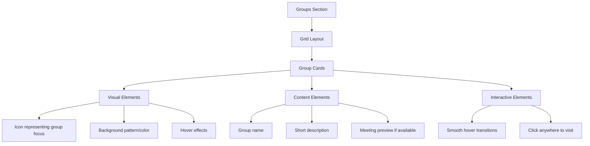

# Groups Display Redesign Plan

## Overview
Transform the current text-based groups display into an engaging, visually rich grid of cards that better represents each group's identity and provides more immediate value to visitors.

## Design Goals
- Improve visual engagement and discoverability
- Maintain accessibility and performance
- Preserve brand identity (black/yellow color scheme)
- Enhance information density without overwhelming users

## Technical Architecture



## Detailed Components

### 1. Grid Layout
- Responsive grid using Tailwind CSS
- Desktop: 2 cards per row
- Mobile: 1 card per row
- Equal height cards with consistent spacing
- Max-width container for optimal readability

### 2. Group Cards

#### Visual Elements
- Group-specific icons:
  - Cafeteria Collective: 🏳️‍⚧️ Trans flag icon
  - Rock and Stone: 🏔️ Mountain icon
  - Disabitch: ♿ Accessibility icon
  - POC Group: 🤝 Community icon
  - Youth Group: 🌟 Star icon
- Subtle background patterns
- Elevation on hover
- Yellow accents for brand consistency

#### Content Structure
- Icon (top)
- Group name (yellow, bold)
- Brief description
- Next meeting preview (if available)
- Full card clickable area

### 3. Interactive Features
- Smooth hover transitions
  - Slight scale (1.02)
  - Subtle elevation shadow
  - Background color shift
- Accessible focus states
- Touch-friendly tap targets

### 4. Technical Specifications

#### CSS Classes (Tailwind)
```css
Base Card:
- bg-gray-900
- rounded-lg
- p-6
- transition-all
- hover:transform
- hover:scale-102
- hover:shadow-lg

Grid:
- grid
- md:grid-cols-2
- gap-6
- max-w-4xl
- mx-auto
- px-4
```

#### Accessibility Considerations
- Proper color contrast (WCAG 2.1)
- Semantic HTML structure
- Keyboard navigation support
- Screen reader friendly content
- Touch target sizing (min 44px)

## Implementation Phases

1. **Setup**
   - Create card component structure
   - Implement base grid layout
   - Add responsive breakpoints

2. **Visual Elements**
   - Add icons and styling
   - Implement background patterns
   - Set up hover effects

3. **Content Integration**
   - Format group information
   - Add meeting preview logic
   - Optimize text display

4. **Interaction & Polish**
   - Implement hover animations
   - Add focus states
   - Test responsive behavior
   - Verify accessibility

5. **Testing & Optimization**
   - Cross-browser testing
   - Mobile device testing
   - Performance verification
   - Accessibility audit

## Success Metrics
- Improved visual appeal
- Maintained or improved accessibility scores
- Responsive behavior across devices
- Performance within budget (no significant impact on load times)
- Positive user feedback on discoverability

## Next Steps
1. Switch to Orchestrator mode for implementation
2. Create necessary components
3. Integrate with existing homepage
4. Test across devices and browsers
5. Gather feedback and iterate if needed