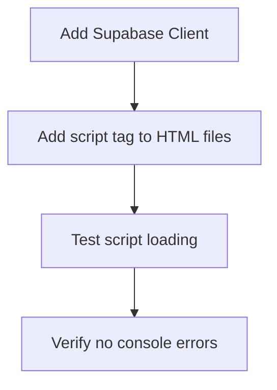
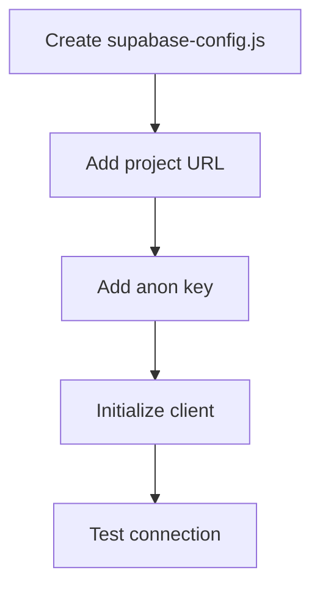
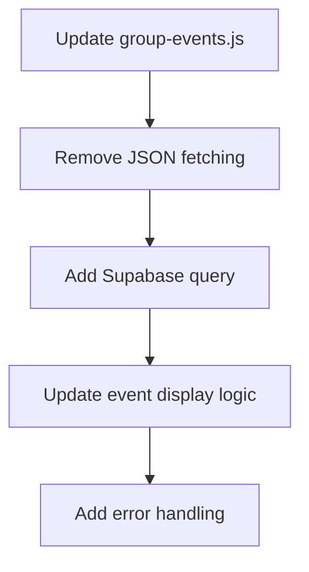
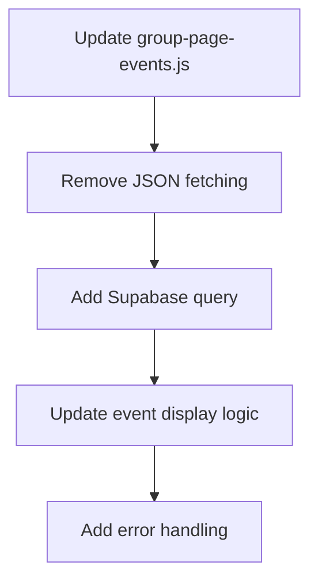
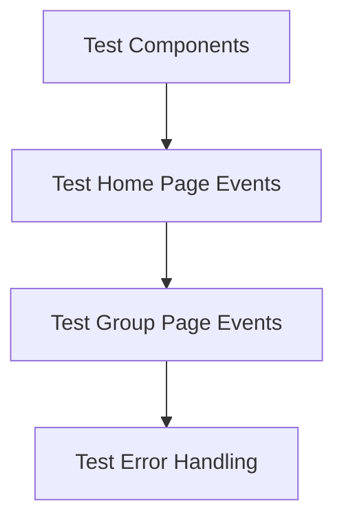
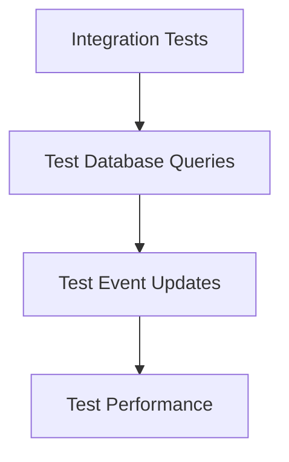

# Supabase Integration - Phase 2 Implementation Plan

## Overview

This document outlines the detailed implementation plan for Phase 2 of the Supabase integration, which focuses on frontend integration and replacing the current JSON-based event system with Supabase queries.

## 1. Initial Setup

### 1.1 Add Supabase Client



Files to modify:
- [`index.html`](../index.html)
- All group HTML files in [`groups/*.html`](../groups/)

Add to HTML head:
```html
<script src="https://cdn.jsdelivr.net/npm/@supabase/supabase-js@2"></script>
```

### 1.2 Create Configuration



Create [`supabase-config.js`](../supabase-config.js):
```javascript
const SUPABASE_URL = 'https://your-project-id.supabase.co';
const SUPABASE_ANON_KEY = 'your-anon-key';

// Initialize Supabase client
const supabase = window.supabase.createClient(SUPABASE_URL, SUPABASE_ANON_KEY);
```

## 2. JavaScript Updates

### 2.1 Replace group-events.js



Key changes:
- Replace `fetch` with Supabase client query
- Update event filtering to use database queries
- Maintain existing UI structure and styling
- Implement proper error handling

### 2.2 Replace group-page-events.js



Key changes:
- Replace `fetch` with Supabase client query
- Update group-specific event filtering
- Maintain existing UI structure and styling
- Enhance error handling and user feedback

## 3. Testing Strategy

### 3.1 Component Testing



Test cases:
1. Home page featured events display
   - Verify correct events are shown
   - Check formatting and styling
   - Test responsive design

2. Individual group page events
   - Verify correct group filtering
   - Check event ordering
   - Test all event fields display correctly

3. Error states and fallbacks
   - Test network errors
   - Test invalid data handling
   - Verify error messages are user-friendly

4. Real-time updates
   - Test event updates reflect immediately
   - Verify data consistency

### 3.2 Integration Testing



Focus areas:
- Database query performance
- Real-time update functionality
- Error handling and recovery
- Cross-browser compatibility

## 4. Rollback Plan

In case of issues:
1. Keep `events.json` as backup
2. Maintain old JS files with `.bak` extension
3. Prepare quick rollback script

## Implementation Timeline

1. **Setup (Day 1)**
   - Create `supabase-config.js`
   - Add Supabase client to HTML files
   - Test basic connectivity
   - Success criteria: Successful connection to Supabase

2. **Development (Days 2-3)**
   - Update `group-events.js`
   - Update `group-page-events.js`
   - Add error handling and logging
   - Success criteria: All features working with Supabase

3. **Testing (Day 4)**
   - Test all components
   - Verify data consistency
   - Performance testing
   - Success criteria: No bugs, good performance

4. **Deployment (Day 5)**
   - Deploy changes incrementally
   - Monitor for issues
   - Keep backup system ready
   - Success criteria: Successful production deployment

## Success Metrics

1. **Performance**
   - Page load time < 2s
   - Event query time < 500ms
   - Smooth real-time updates

2. **Reliability**
   - Zero data loss
   - Graceful error handling
   - Quick recovery from issues

3. **User Experience**
   - Maintain existing UI/UX
   - No visible changes to end users
   - Improved admin experience

## Next Steps

After approval of this plan:
1. Switch to Code mode for implementation
2. Begin with Initial Setup phase
3. Regular check-ins at each milestone
4. Document any deviations from plan